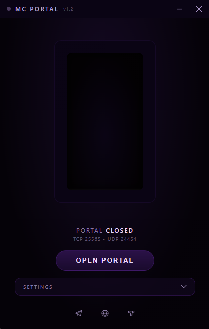
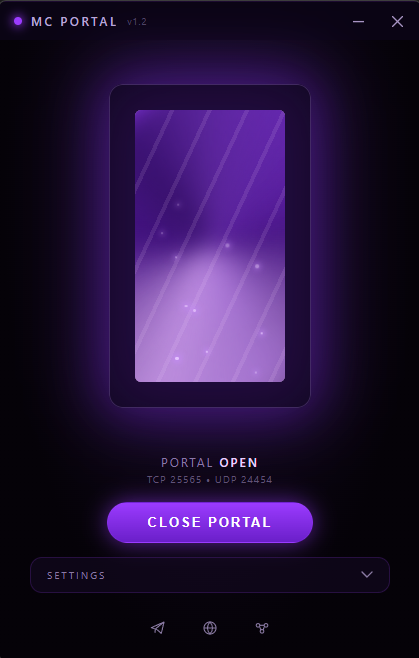

# MC Portal

A tiny Windows utility that opens and closes the Minecraft port in your firewall with one click — visualized as a Nether portal that lights up when the port is open.

  
  

## What it does

Hosting a Minecraft Java server means poking a hole in the Windows Firewall for TCP port 25565, then remembering to close it again when you're done. MC Portal turns that into a single button:

- **Open Portal** — adds an inbound firewall rule for TCP 25565 (and UDP 24454 for voice chat, if enabled)
- **Close Portal** — removes it
- The portal itself doubles as the status indicator: dark and dormant when closed, and when you open the port the light climbs up the frame until the portal is glowing and animated

## Features

- One-click firewall rule management via `netsh advfirewall`
- Custom frameless UI with a live, animated Nether portal indicator
- System tray support — minimize instead of quitting, with a tray menu to show the window, toggle the port, or quit
- The tray icon is a mini portal that reacts to the port: it lights up when you open the port and powers down when you close it, and the tooltip shows the current state
- Optional voice chat port (UDP 24454, the default for Simple Voice Chat) opened and closed together with the Minecraft port
- Crash protection — if the app is killed, crashes, or the PC loses power while the port is open, the next launch detects the leftover firewall rules, closes them, and shows a notice
- Self-elevates for admin rights on launch (required for firewall changes)
- Single-instance lock — launching it twice just shows a notice instead of starting a second copy
- Configurable behavior (see [Settings](#settings))
- Settings are stored in a plain `settings.json` next to the app, no registry writes
- Checks GitHub Releases on launch and shows an in-app banner if a newer version is available

## Download

Grab the latest build from the [Releases page](https://github.com/actually-aloy/mc-portal/releases/latest) — download the `.exe` and run it, no setup needed.

Requires Windows 10/11. The app will prompt for admin rights on launch — this is required to add and remove firewall rules.

## Settings

| Setting | Default | Description |
|---|---|---|
| Open port on launch | Off | Opens the port automatically when the app starts |
| Close port on exit | On | Closes the port when you fully quit (via the tray menu, or with "minimize to tray" off) |
| Minimize to tray | On | The close button hides the window instead of quitting the app |
| Open voice chat port (24454) | On | Also opens and closes UDP 24454 alongside the Minecraft port |

## What it touches on your system

MC Portal is closed source, so here is everything it changes:

- **Firewall rules** — two inbound allow rules, named `MC Portal (Minecraft Server)` (TCP 25565) and `MC Portal (Minecraft Voice Chat)` (UDP 24454). They only exist while the port is open.
- **Files next to the app** — `settings.json` (your settings) and `session.json` (present only while the port is open, used for crash protection).
- **Network** — one request to the GitHub Releases API on launch to check for updates. Nothing else is sent anywhere.

## Notes

- Targets **Minecraft Java Edition** (TCP 25565). Bedrock Edition uses UDP 19132 and isn't covered.
- Requires administrator privileges, since firewall rules can't be managed otherwise.
- You're still responsible for forwarding the port on your router if you want players outside your LAN to connect — this app only manages the local Windows Firewall rule.
- A power cut or crash can't be handled at the moment it happens, so the firewall rule stays until the next time you launch MC Portal, which then closes it. If you leave a rule open by mistake, you can also remove it manually from Windows Defender Firewall.

## License

MC Portal is free to download and use, but it is not open source and the source code is not published. Redistributing or repackaging it isn't permitted — see [LICENSE.txt](LICENSE.txt).

## Contact

- Telegram: [@actually_aloy](https://t.me/actually_aloy)
- GitHub: [actually-aloy](https://github.com/actually-aloy)
- Website: [actually-aloy.github.io/site](https://actually-aloy.github.io/site)
